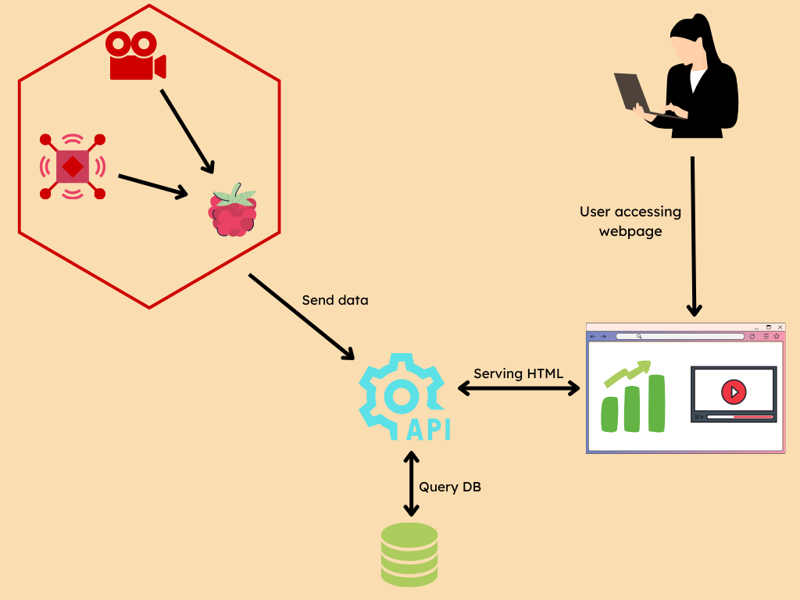

# Projet CSF

- [Projet CSF](#projet-csf)
  - [Commandante](#commandante)
  - [Fonctionnalités](#fonctionnalités)
    - [Interface web](#interface-web)
    - [Données](#données)
  - [Architecture](#architecture)
    - [API](#api)
    - [Base de données](#base-de-données)
    - [Interface Web](#interface-web-1)
    - [Carte éléctronique et capteurs](#carte-éléctronique-et-capteurs)
  - [Capteurs utilisés](#capteurs-utilisés)

___

## Commandante 

Le Commandante est une station météo avec une interface web permettant de visualiser des informations météorologiques sur le campus de Valrose et d'accéder à une transmission vidéo en direct

## Fonctionnalités 

### Interface web

- [ ] Vidéo
- [ ] Données

### Données
- [ ] Température
- [ ] Pression
- [ ] Vent
- [ ] Humidité
- [ ] Luminosité
  
## Architecture

### API

[L'api](https://github.com/CorentinGS/csf-api/tree/main) est écrite en Golang avec [GoFiber](https://github.com/gofiber/fiber). 
Elle dispose de 2 endpoints:

| Type | Url       | Description                                                     |
| ---- | --------- | --------------------------------------------------------------- |
| GET  | /api/data | Retourne les dernières données météos sous format json          |
| POST | /api/data | Ajoute dans la base de données des données météos (format json) |

### Base de données

Pour la base de données, nous utilisons MongoDB 

### Interface Web 

L'interface web est écrite en HTML/CSS/JS et TailwindCSS 

### Carte éléctronique et capteurs

Les capteurs sont branchés à un raspberry PI 

## Capteurs utilisés

- ... 
- ...

